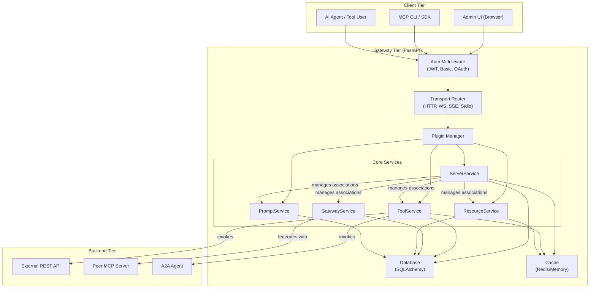

# Architecture Overview

The **MCP Gateway** acts as a unified entry point for tools, resources, prompts, and servers, federating local and remote nodes into a coherent MCP-compliant interface.

This gateway:

- Wraps REST/MCP tools and resources under JSON-RPC and streaming protocols
- Offers a pluggable backend (cache, auth, storage)
- Exposes multiple transports (HTTP, WS, SSE, StreamableHttp, stdio)
- Automatically discovers and merges federated peers

## System Architecture

> Each service (ToolService, ResourceService, etc.) operates independently with unified auth/session/context layers.

## Additional Architecture Documentation

- [Export/Import System Architecture](export-import-architecture.md) - Technical design of configuration management system

## ADRs and Design Decisions

We maintain a formal set of [Architecture Decision Records](adr/index.md) documenting all major design tradeoffs and rationale.

📜 See the [full ADR Index →](adr/index.md)
